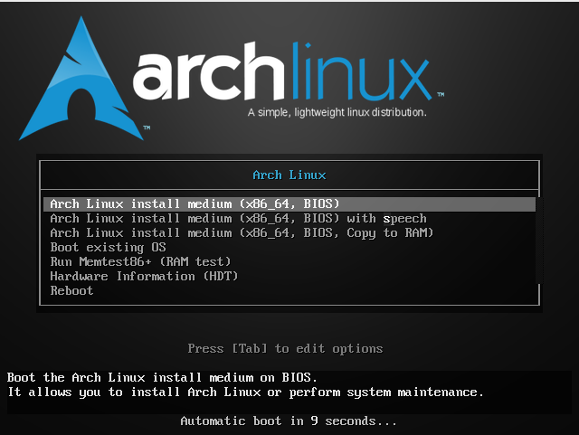
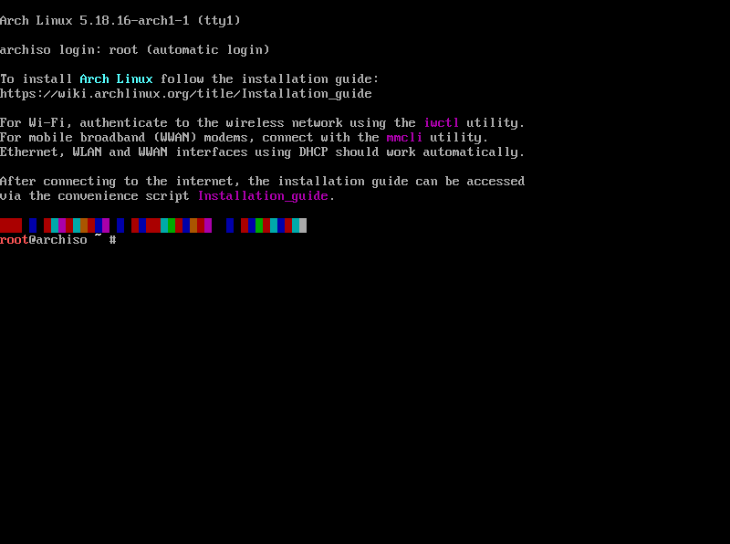

## 前言

#### 此次安装教程基于Virtualbox以方便截图

#### 教程来源于多处加上自己习惯改编

[在家无聊？一起来装Arch Linux吧！（安装篇）作者：NeMaZHENG](https://www.coolapk.com/feed/16407712?shareKey=YzZhZjQwNDg5YTY0NjMxMDcwNTY~&shareUid=2991758&shareFrom=com.coolapk.market_12.4.2)

[Arch Linux安装好了该做什么？进来康康 作者：NeMaZHENG](https://www.coolapk.com/feed/16504103?shareKey=ZTA0NDM4NmQxYzVkNjMxMDcwZjA~&shareUid=2991758&shareFrom=com.coolapk.market_12.4.2)

[archlinux 简明指南 — Arch Linux 安装使用教程](https://arch.icekylin.online/prologue.html)

[Arch Linux 安装使用教程 - ArchTutorial - Arch Linux Studio](https://archlinuxstudio.github.io/ArchLinuxTutorial/#/)

[官方教程](https://wiki.archlinux.org/title/Installation_guide_(%E7%AE%80%E4%BD%93%E4%B8%AD%E6%96%87))

#### 排名不分先后

 

---

## 开始安装

### 选1或者3都行

### 漆黑的命令行

