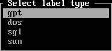
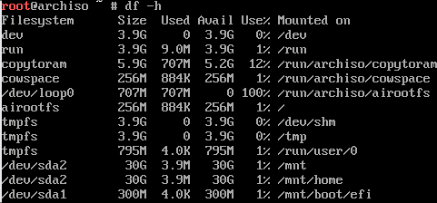
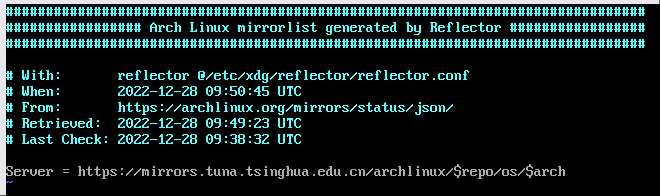

## 前言

此次安装教程基于archlinux-2022.12.01-x86_64.iso，请**注意时效性**

使用Virtualbox以方便截图


---

## 开始安装

电脑启动选择镜像作为启动，选择第一个开始安装。~~在以前的版本中有复制到内存中的选项该版本没有~~

>[!TIP]
>
>使用<code>clear</code>命令清屏
>
>使用tab按键自动补全
>
>使用<code>rmmod pcspkr</code>或者<code>xset b off</code>命令关闭蜂鸣器（待验证）~~该版本iso虚拟机未报警实体机待验证~~


-----------

## 连接网络（安装必须需要网络连接）

### 网卡可用性检查

先使用<code>ip link</code>检测网络接口，如果无线网卡不能（特别是螃蟹卡）需先连接有线网络


如上实例，1为系统自身的虚拟接口（local），2是有线网卡接口（enp\*\*\*），3为无线网卡接口（wlp\*\*\*）

### 确认网卡已开启电源

上图中若网卡<>内显示为DOWN,执行<code>ip link set \<device\> on</code>

若报错rfkill执行<code>rfkill list</code>确认没有被rfkill所关闭。确保网卡下方的soft block显示的是**no**，如果为**yes**，执行<code>rfkill unblock wlan</code>

### 有线网卡

一般来说会自动通过dhcp分配ip地址，如果没有输入命令<code>dhcpcd</code>即可


### 无线网卡（内置）

```bash
iwctl # iwd命令行控制
device list # 列出无线网卡设备名，wlan0等
station wlan0 scan # 扫描网络
station wlan0 get-networks # 列出所有 wifi 网络，无法显示中文（下图显示因为不是在tty中）
station wlan0 connect <wifi-name> # 连接，回车后输入密码再回车，同样无法连接带有中文的名称或者密码的wifi
exit # 连接成功后退出
```


### 检测连接性

```bash
ping www.baidu.com
```

查看是否有连续输出


---

## 确认时间同步

```bash
timedatectl status
```


时间为UTC时间，+8小时为北京时间，不用考虑修改时区，时间正确即可，否则无法连接源


---

## 分盘

~~相信现在电脑都是UEFI模式启动了吧~~

### 确认为UEFI模式

```bash
ls /sys/firmware/efi/efivars
```

如果有大量输出为UEFI模式，以下**仅针对UEFI模式安装**

### efi分区

#### 已经安装过win

win已经分好过一个efi（esp）分区，直接使用即可，即下图的nvme0n1p1，能看到SYSTEM_DRV标识


#### 全新硬盘

```bash
cfdisk /dev/<driver>
```

选择gpt回车



左右方向键选择New，回车，输入想分配的大小，efi分区300m左右，键入300M回车


接着选择Type调整分区类型


选择第一个


### 根目录

同上，只不过不用重新选择分区格式了

### Swap交换分区（可选）

同上，分区格式选择Linux swap

一般分配大小为40%-100%的**内存**大小

具体内容参考<待补充>

> [!TIP]
>
> 一般来说会选择交换文件，两者效果相同而且更方便，**但是如果文件系统为btrfs，则需要额外设置**

完成后选择Write回车输入yes保存，**请确认没有清空windows系统的内容**，然后选择Quit退出


但是若使用btrfs文件系统仍需格式化。~~所以那个type完全没用是吧~~

### 格式化分区

```bash
mkfs.fat -F 32 /dev/sda1 # 格式化efi分区
mkfs.ext4 /dev/sda2 # 格式化根分区为ext4格式
mkfs.btrfs /dev/sda2 # 格式化根分区为btrfs格式
# 此处位置仅为示例，两个格式二选一，btrfs牺牲微小性能的同时，支持了更多功能<待补充>
```

### 挂载分区

#### ext4文件系统

```bash
mount /dev/sda2 /mnt
mkdir /mnt/boot/EFI # 如果装了windows则已有该目录
mount /dev/sda1 /mnt/boot/EFI
```

#### btrfs文件系统

```bash
mount -t btrfs -o subvol=/@,compress=zstd /dev/sda2 /mnt
mkdir /mnt/home
mount -t btrfs -o subvol=/@home,compress=zstd /dev/sda2 /mnt/home 
mkdir -p /mnt/boot/EFI
mount /dev/sda1 /mnt/boot/EFI
```

挂载完成后<code>df -h</code>检测一下




---

## 安装

没错，到现在都是准备工作，才刚刚开始安装

### 换源

由reflector服务会自动挑选出几个“合适的源”，实际上可能并不怎么合适，所以需要进行修改

```bash
vim /etc/pacman.d/mirrorlist
```

> [!TIP]
>
> xxxxxxxxx


