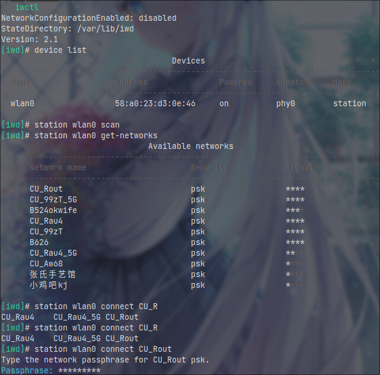
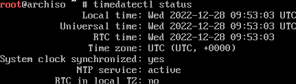
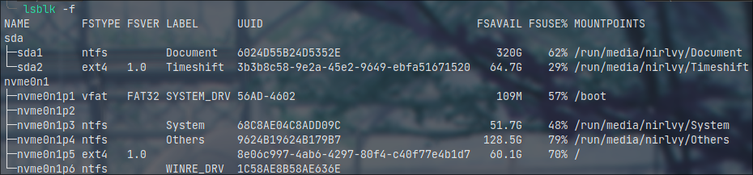
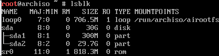
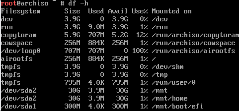
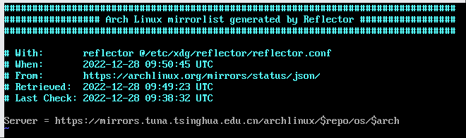

## 前言

此次安装教程基于archlinux-2022.12.01-x86_64.iso，请**注意时效性**

使用Virtualbox以方便截图


---

## 开始安装

电脑启动选择镜像作为启动，选择第一个开始安装。~~在以前的版本中有复制到内存中的选项该版本没有~~

>[!TIP]
>
>使用`clear`命令清屏
>
>使用tab按键自动补全
>
>使用方向上键查看历史记录
>
>使用`rmmod pcspkr`或者`xset b off`命令关闭蜂鸣器（待验证）~~该版本iso虚拟机未报警实体机待验证~~


-----------

## 连接网络（安装必须需要网络连接）

### 网卡可用性检查

先使用`ip link`检测网络接口，如果无线网卡不能（特别是螃蟹卡）需先连接有线网络


如上实例，1为系统自身的虚拟接口（local），2是有线网卡接口（enp\*\*\*），3为无线网卡接口（wlp\*\*\*）

### 确认网卡已开启电源

上图中若网卡<>内显示为DOWN,执行`ip link set \<device\> on`

若报错rfkill执行`rfkill list`确认没有被rfkill所关闭。确保网卡下方的soft block显示的是**no**，如果为**yes**，执行`rfkill unblock wlan`

### 有线网卡

一般来说会自动通过dhcp分配ip地址

### 无线网卡（内置）

```bash
iwctl # iwd命令行控制
device list # 列出无线网卡设备名，wlan0等
station wlan0 scan # 扫描网络
station wlan0 get-networks # 列出所有 wifi 网络，无法显示中文（下图显示因为不是在tty中）
station wlan0 connect <wifi-name> # 连接，回车后输入密码再回车，同样无法连接带有中文的名称或者密码的wifi
exit # 连接成功后退出
```



### 检测连接性

```bash
ping www.baidu.com
```

查看是否有连续输出


---

## 确认时间同步

```bash
timedatectl status
```



时间为UTC时间，+8小时为北京时间，不用考虑修改时区，时间正确即可，否则无法连接源


---

## 分盘

~~相信现在电脑都是UEFI模式启动了吧，而且建议在windows那边先把盘分好~~

### 确认为UEFI模式

```bash
ls /sys/firmware/efi/efivars
```

如果有大量输出为UEFI模式，以下**仅针对UEFI模式安装**，~~BIOS模式以后再补上~~

### EFI分区

#### 已经安装过windows

win已经分好过一个efi（esp）分区，直接使用即可，即下图的nvme0n1p1，能看到SYSTEM_DRV标识



#### 全新硬盘

```bash
cfdisk /dev/<driver>
```

选择gpt回车


左右方向键选择New，回车，输入想分配的大小，efi分区300m左右，键入300M回车


接着选择Type调整分区类型


选择第一个


### 根目录

同上，只不过不用重新选择分区格式了

### Swap交换分区（可选，不推荐）

同上，分区格式选择Linux swap

一般分配大小为40%-100%的**内存**大小

同样的方法分区

然后

```bash
mkswap /dev/sdxy
```

想要启用一个设备作为交换分区：

```bash
swapon /dev/sdxy
```

想要启动时自动启用交换分区，添加一个条目到 `/etc/fstab`:

```
UUID=device_UUID none swap defaults 0 0
```

UUID可以通过以下命令获得：

```bash
lsblk -no UUID /dev/sdxy
```

> [!TIP]
>
> 一般来说会选择[交换文件]()，两者效果相同而且更方便，**但是如果文件系统为btrfs，则需要额外设置**

完成后选择Write回车输入yes保存，**请确认没有清空windows系统的内容**，然后选择Quit退出




但是若使用btrfs文件系统仍需格式化。~~所以那个type完全没用是吧~~

### 格式化分区

```bash
mkfs.fat -F 32 /dev/sda1 # 格式化efi分区
mkfs.ext4 /dev/sda2 # 格式化根分区为ext4格式
mkfs.btrfs /dev/sda2 # 格式化根分区为btrfs格式
# 此处位置仅为示例，两个格式二选一
# btrfs牺牲微小性能的同时，支持了更多功能，如透明和自动压缩，节省空间，延长闪存寿命，以及极为迅速的备份还原
```

### 挂载分区

#### ext4文件系统

```bash
mount /dev/sda2 /mnt
mount /dev/sda1 /mnt/boot
```

#### btrfs文件系统 更为详细参考

```bash
# 先创建子卷
mount -t btrfs -o compress=zstd /dev/sda2 /mnt # -t指定文件系统 -o指定参数 挂载时启动压缩
btrfs subvolume create /mnt/@ # 创建 / 目录子卷
btrfs subvolume create /mnt/@home # 创建 /home 目录子卷
btrfs subvolume list -p /mnt # 查看挂载情况
umount /mnt # 解除挂载
# 重新挂载子卷
mount -t btrfs -o subvol=/@,compress=zstd /dev/sda2 /mnt
mkdir /mnt/home
mount -t btrfs -o subvol=/@home,compress=zstd /dev/sda2 /mnt/home 
mkdir /mnt/boot
mount /dev/sda1 /mnt/boot
```

挂载完成后`df -h`检测一下




---

## 安装

没错，到现在都是准备工作，才刚刚开始安装

### 换源

由reflector服务会自动挑选出几个“合适的源”，实际上可能并不怎么合适，所以需要进行修改

```bash
vim /etc/pacman.d/mirrorlist
```

> [!NOTE]
>
> vim分为分为三种模式，分别是**命令模式（Command mode）**，**输入模式（Insert mode）**和**底线命令模式（Last line mode）**。 这三种模式的作用分别是：
>
> ##### 命令模式：
>
> 用户刚刚启动 vi/vim，便进入了命令模式。
>
> 此状态下敲击键盘动作会被Vim识别为命令，而非输入字符。比如我们此时按下i，并不会输入一个字符，i被当作了一个命令。
>
> 以下是常用的几个命令：
>
> - **i** 切换到输入模式，以输入字符。
> - **x** 删除当前光标所在处的字符。
> - **:** 切换到底线命令模式，以在最底一行输入命令。
>
> 若想要编辑文本：启动Vim，进入了命令模式，按下i，切换到输入模式。
>
> ##### 输入模式
>
> 在命令模式下按下i就进入了输入模式。
>
> 在输入模式中，可以使用以下按键：
>
> - **方向键**，在文本中移动光标
> - **HOME**/**END**，移动光标到行首/行尾
> - **Page Up**/**Page Down**，上/下翻页
> - **ESC**，退出输入模式，切换到命令模式
>
> ##### 底线命令模式
>
> 在命令模式下按下:（英文冒号）就进入了底线命令模式。
>
> 在底线命令模式中，基本的命令有（已经省略了冒号）：
>
> - q 退出程序
> - w 保存文件
> - ！强制执行，如修改但是不保存退出使用q！
>
> 按ESC键可随时退出底线命令模式。

使用dd删除大部分的源，只保留内地的几个，如

```
Server = https://mirrors.tuna.tsinghua.edu.cn/archlinux/$repo/os/$arch
Server = http://mirrors.aliyun.com/archlinux/$repo/os/$arch
```

最后保存退出



### 使用pacstrap脚本安装系统

```bash
pacman -Syy # 强制更新软件包缓存
pacman -Syu # 有时软件包过时（archlinux-keyring）如密钥会导致部分软件无法安装，如果下一步不报错这一步可以跳过
pacstrap /mnt base base-devel linux linux-firmware btrfs-progs # 仅在使用btrfs文件系统时需要安装btrfs-progs
```

> [!TIP]
>
> pacman -S foo 安装一个包
>
> pacman -S extra/<package> 选择一个源的包安装
>
> pacman -Syu 更新系统，y表示更新包缓存，yy强制更新，u表示更新系统
>
> pacman -Ss foo 搜索一个软件包，如果只想搜索名称，可以使用正则表达式'^foo-'
>
> pacman -Si 搜索一个包的详细信息
>
> pacman -Scc 清除全部缓存
>
> pacman -U 指定文件安装一个包
>
> pacman -Rns foo 卸载一个包及其所有没有被其他已安装软件包使用的依赖关系且不备份配置文件
>
> pacman -Rc foo 递归卸载，如同时卸载被依赖的软件
>
> pacman -Qs foo 搜索本地安装的软件
>
> pacman -Qi  foo 本地一个包的详细信息
>
> pacman -Qtdq | pacman -Rns - 卸载所有孤儿包

安装一些必要软件

```bash
pacstrap /mnt vim networkmanager dhcpcd
```

个人联网程序更倾向于使用networkmanager而不是iwd或其他，networkmanager提供的nmtui图形界面足够好用，同时一些DE如gnome，kde默认使用它

### 生成fstab文件

fstab文件用来开机指引挂载文件系统，也可以自己修改（待补充）实现自动挂载windows的硬盘

```bash
genfstab -U /mnt > /mnt/etc/fstab
```

> [!TIP]
>
> \> 表示覆盖原有文件写入
>
> \>\> 表示在原来的末端下一行继续写入

### chroot进入系统

```bash
arch-chroot /mnt
```

### 设置时区

```bash
ln -sf /usr/share/zoneinfo/Asia/Shanghai /etc/localtime
```

~~相信都在国内吧~~，别问为什么不是北京，没有就是没有~~可以自己加但是没必要~~

### 设置系统时间

```bash
hwclock --systohc
```

设置为硬件时间为UTC时间，会导致linux和windows切换后windows的时间提前八个小时，[参考](md/Tips#Windows和Linux系统时间同步)

### 本地化

```bash
vim /etc/locale.gen
```

删除`en_US.UTF-8 UTF-8`和`zh_CN.UTF-8 UTF-8`前的#，保存退出

```bash
locale-gen
echo LANG=en_US.UTF-8 > /etc/locale.conf
```

> [!WARNING]
>
> 不推荐给locale.conf设置中文locale，会导致tty乱码，如启动失败时显示的日志部分可能为方块或者？，所以针对用户单独设置locale（待补充），也可以使用[chcon](https://aur.archlinux.org/packages/zhcon)<sup>AUR</sup>实现tty显示中文以及输入，~~反正我没用过~~

### 设置主机名

```bash
echo myhostname(你的主机名) > /etc/hostname
```

接着重新联网，[参考](#连接网络（安装必须需要网络连接）)

同时设置自启dhcpcd服务用于自动分配ip地址

```bash
systemctl enable --now dhcpcd
```

### 设置Root密码

```bash
passwd
```

### 安装微码用于自动修正部分错误

```bash
pacman -S intel-ucode # 因特尔cpu
pacman -S amd-ucode # AMDcpu
```

### 安装启动引导器

最常用最简单的还是grub

```bash
pacman -S grub efibootmgr os-prober
```

> [!NOTE]
>
> `efibootmgr`被 GRUB 脚本用来将启动项写入 NVRAM
>
> `os-prober`用来探测windows引导项用来grub界面选择windows启动

```bash
grub-install --target=x86_64-efi --efi-directory=/boot --bootloader-id=Arch
```

> [!NOTE]
>
> `--target=x86_64-efi`指定安装格式（必要）
>
> `--efi-directory=/boot`指定安装位置，会自动创建EFI和grub文件夹（必要）
>
> `--bootloader-id=Arch`指定创建的文件夹名称，默认为arch（非必要）

最后目录会是这样

./EFI 

├── arch 

│      └── grubx64.efi 

└──  Microsoft

### 修改grub启动内核参数

```bash
vim /etc/default/grub
```

在`GRUB_CMDLINE_LINUX_DEFAULT`中为了检查启动错误可以考虑删除`quiet`，加入`nowatchdog`参数禁用看门狗加快开机关机速度，~~不是服务器谁用这个啊~~

如果是要加入windows启动项，除了要安装os-prober，还有取消最后一行的注释

检查一下/boot是否有内核文件生成

```bash
ls /boot # 查看有没有initramfs-linux.img等文件
mkinitcpio -P # 没有生成就执行
grub-mkconfig -o /boot/grub/grub.cfg
```

> [!WARNING]
>
> 每次执行过`grub-install`，更新完或者安装了其他内核，或者修改过`/etc/default/grub`之后都需要重新执行该命令
>
> 部分主板可能会导致grub不显示引导项，上述命令替换为
>
> ```bash
> grub-install --target=x86_64-efi --efi-directory=/boot --removable
> ```
>
> 或者在`grub-install`之后
>
> ```bash
> mv /boot/EFI/grub esp/EFI/BOOT
> mv /boot/EFI/BOOT/grubx64.efi /boot/EFI/BOOT/BOOTX64.EFI
> ```

 [关于GRUB的美化](md/Tips#关于grub的美化)


---

## 确保系统更新

实际上本身就应该定期执行

```bash
pacman -Syu
```

如果怕滚炸，可以

```bash
pacman -Syu --ignore=linux
```

同时定期[备份]()


---

## 创建非特权用户

只使用root用户是危险的，特别是开放了ssh的root用户，~~不过应该很少有人使用arch做服务器吧~~，同时`AUR helper`也不被允许在root下使用

```bash
useradd -m -G "附加组" -s "登陆shell" "用户"
```

- `-m`/`--create-home`：创建用户主目录`/home/[用户名]`；在自己的主目录内，即使不是root用户也可以读写文件、安装程序等等
- `-G`/`--groups`：用户要加入的附加组列表；使用逗号分隔多个组，不要添加空格；如果不设置，用户仅仅加入初始组
- `-s`/`--shell`：用户默认登录shell的路径；启动过程结束后，默认启动的登录shell在此处设定；请确保使用的shell已经安装，默认是 `bash`

如

```bash
useradd -m -G wheel -s /bin/bash nirlvy
```

`wheel`管理组，可以访问 `journal` 文件和 `CUPS` 打印服务，可以用户 `sudo`和 `su`命令权限管理(需要额外[设置](md/arch_install_next#修改sudoers文件))

如果是wm用户，且使用`light`包控制亮度，还需加入`input`和`vedio`组

> [!WARNING]
>
> 请不要使用`/usr/bin/bash`等替换`/bin/bash`

[更多用户组相关内容](md/Tips.md#用户组)

### 添加密码

```bash
passwd "用户"
```

### 修改sudoers文件

默认`wheel`组也是不能够使用`sudo`的，需要修改`/etc/sudoers`，但是一般不直接编辑

```bash
EDITORS=vim visudo # 因为默认编辑器为vi,并没有安装所以单独指定
```

删除

```
## Uncomment to allow members of group wheel to execute any command
# %wheel ALL=(ALL:ALL) ALL
```

第二行前的#，保存退出

### 切换到新用户

```bash
exit
```

登陆新用户

```bash
echo EDITORS=vim >> ~/.bashrc # 如果使用其他shell改成对应文件
```


---

## 开启 32 位支持库与 archlinuxcn仓库以及arch4edu仓库以及Aur支持

```bash
sudo vim /etc/pacman.conf
```


取消[multilib]下一行的注释

在最后追加四行，保存退出

```bash
sudo pacman -S archlinuxcn-keyring # archlinuxcn源密钥

sudo pacman-key --recv-keys 7931B6D628C8D3BA # arch4edu源密钥
sudo pacman-key --finger 7931B6D628C8D3BA
sudo pacman-key --lsign-key 7931B6D628C8D3BA

sudo pacman -Syyu

sudo pacman -S paru # AUR helper之一
```

`paru`和`pacman`命令基本相同

```bash
paru # 等价于paru -Syu
```

