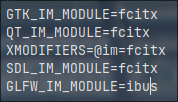

## 以下内容基于拥有图形化界面

## 安装fcitx输入法

```bash
sudo pacman -S fcitx5-im
sudo pacman -S fcitx5-chinese-addons # 官方中文输入引擎
sudo pacman -S fcitx5-pinyin-moegirl # 萌百词库
sudo pacman -S fcitx5-pinyin-zhwiki # 维基百科词汇
sudo pacman -S fcitx5-material-color # 输入法主题
```

可选：

- fcitx-sunpinyin 在输入速度和输入精度之间有较好的平衡。
- fcitx-libpinyin 算法比 sunpinyin 先进。
- fcitx-rime 即著名中文输入法 Rime IME的 Fcitx 版本。但它不支持 Fcitx 本身的 #特殊符号 和 #快速输入 功能，自定义设置请参见官方
- fcitx-googlepinyin Google 拼音输入法 for Android
- fcitx-sogoupinyin<sup>AUR</sup>, 搜狗输入法for linux—支持全拼、简拼、模糊音、云输入、皮肤、中英混输入
- fcitx-cloudpinyin 可以提供云拼音输入的支持，支持 Fcitx 下的所有拼音输入法，Fcitx-rime 除外
- fcitx-baidupinyin<sup>AUR</sup> 百度拼音输入法的fcitx wrapper。

> [!NOTE]
>
> 上标`AUR`表示通过`AUR helper`安装，如`paru`

### 加入环境变量

```bash
sudo vim /etc/environment
```

加入如下几行

```
GTK_IM_MODULE=fcitx5
QT_IM_MODULE=fcitx5
XMODIFIERS=\@im=fcitx5
SDL_IM_MODULE=fcitx
GLFW_IM_MODULE=ibus # 只接受ibus参数
```



```bash
 fcitx5-configtool
```


将中文加入左边

附加组件-经典用户界面 选择皮肤


---

## 蓝牙

如果为桌面环境一般含有对应的蓝牙管理器

对于wm

```bash
sudo pacman -S blueman
```

支持更多蓝牙音频格式以及连接格式

```bash
sudo pacman -S pipewire-pulse
```


---

## 备份

```bash
sudo pacman -S timeshift
```

文件系统为`btrfs`选择快照类型`BTRFS`，否则为`RSYNC`

`BTRFS`无法选择其他盘放置快照位置

`RSYNC`需要排除部分位置节省空间和时间

如果需要自动备份，除了应用内需要设置，同时需要开启服务

```bash
systemctl enable --now cronie
```

> [!TIP]
>
> 如果遇到情况无法正常开机可以选择非Arch的live环境进行还原，同时还原时**不要**恢复grub配置


---

## 显卡配置

### 通用配置

#### Intel核显

```bash
sudo pacman -S mesa lib32-mesa # 使用第 8 代及更高版本硬件否则安装mesa-amber和lib32-mesa-amber
sudo pacman -S xf86-video-intel # 对于 DDX 驱动支持(可提供对Xorg的2D加速)，通常不需要
sudo pacman -S vulkan-intel lib32-vulkan-intel # vulkan驱动
```

#### Nvidia

```bash
sudo pacman -S nvidia # GeForce 930起、10系至20系、 Quadro/Tesla/Tegra K-系列以及更新的显卡（NV110以及更新的显卡家族）,及linux内核
sudo pacman -S nvidia-lts # lts内核
sudo pacman -S nvidia-dkms # 其他内核，如zen,lily
paru -S nvidia-beta # 上述不能够正常运行
paru -S nvidia-470xx-dkms # GeForce 630-920
paru -S nvidia-390xx-dkms # GeForce 400/500/600 系列
sudo pacman -S nvidia-open # Turing (NV160/TUXXX) 系列或更新的显卡可选安装（不稳定，且不适用于具有 AMD 集成 GPU 的系统），非linux内核安装nvidia-open-dkms
sudo pacman -S xf86-video-nouveau # 更老的卡
```

都需要安装的包

```bash
sudo pacman -S nvidia-settings nvidia-utils lib32-nvidia-utils opencl-nvidia lib32-opencl-nvidia
```

### 笔记本配置

#### [optimus](https://github.com/Askannz/optimus-manager)方案

除了通用安装的包，还需要安装

```bash
paru -S optimus-manager optimus-manager-qt bbswitch # 非linux内核安装bbswitch-dkms
systemctl enable --now optimus-manager
```

通过右击optimus-manager-qt的托盘图标选择模式，也可使用命令切换，默认保持核显模式即可，可以选择使用的时候调整到nvidia模式，也可选择hybird模式运行应用命令前加入`prime-run`(需要安装`nvidia-prime`)


---

## 基础省电

安装

```bash
sudo pacman -S tlp
systemctl enable --now tlp
```

基本上不用单独去修改设置，如果想安装`tlpui`

